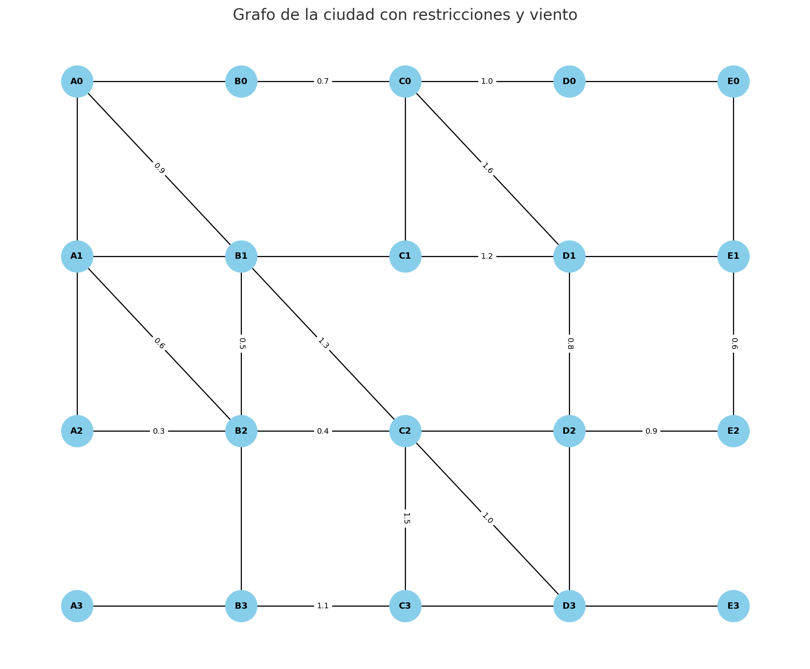

# Deliverie1-Artificial-Intelligence-

## Participantes
- Sebastian Andres Medina Cabezas
- Samuel DeOssa

## Problema 1

Desarrollo de un agente de búsqueda para navegación de un dron en una ciudad modelada como grafo.

### Resumen del problema
- Planificar la ruta minimizando el costo total = distancia euclidiana + λ_w · viento por arista.
- Requisitos: representar el espacio de estados, hallar el camino inicio→meta, mostrar la exploración paso a paso y reportar camino, número de nodos explorados y tiempo de ejecución. Comparar A* vs BFS. Considerar calles ortogonales/diagonales y algunas restricciones.

### Solución implementada
- Modelo CityGraph: coordenadas por nodo; aristas no dirigidas con penalización de viento; costo de arista = euclidiana + λ_w · viento; heurística h = euclidiana (admisible/consistente).
- Algoritmos: A* con cola de prioridad y trazas (verbose), BFS no ponderado; reconstrucción de camino y cálculo del costo real del camino.
- Demo: malla 5×4 (A0..E3); calles restringidas y mapa de vientos (con claves frozenset); atajos diagonales; aristas agregadas de forma explícita.

     

### Tecnologías y librerías
- Python 3
- Librerías estándar: math (hypot), heapq, time, dataclasses, typing, collections.deque
- Estructuras: dict para coordenadas/adyacencia; frozenset como clave no dirigida para restricted y wind_map
- Entorno: VS Code

## Problema 2

Desarrollo de un agente evolutivo...
